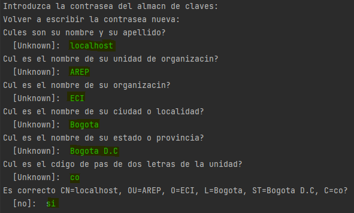

# SecureApp!

This is a repository that includes all the code needed to successfully deploy a _SecureApp_ and to AWS, built with Java (Spark) and basic web technologies (HTML, JavaScript, CSS).

## Architecture

---


## Setup the project!
1. Delete all the files inside the **_keystores_** folder.
2. Create a new key:
```bash
keytool -genkeypair -alias ecikeypair -keyalg RSA -keysize 2048 -storetype PKCS12 -keystore ecikeystore.p12 -validity 3650
```
3. Add a password and fill the gaps as follows:

4. Save the certificate:
```bash
keytool -export -keystore ./ecikeystore.p12 -alias ecikeypair -file ecicert.cer
```
5. Add a trusted store using the certifiactes
```bash
keytool -import -file ./ecicert.cer -alias firstCA -keystore myTrustStore
```

## Run the project locally:
---
1. Clone the project:
```bash
git clone https://github.com/juancho20sp/AREP-SecureApp
```
2. Compile the project:
```bash
mvn clean install
```
3. Run the HelloService app:
- For Windows:
```bash
java -cp "target/classes;target/dependency/*" edu.escuelaing.arep.HelloServer
```
- For Unix systems:
```bash
java -cp "target/classes:target/dependency/*" edu.escuelaing.arep.HelloServer
```
4. Run the main app:
- For Windows:
```bash
java -cp "target/classes;target/dependency/*" edu.escuelaing.arep.App
```
- For Unix systems:
```bash
java -cp "target/classes:target/dependency/*" edu.escuelaing.arep.App
```

## Run the project in AWS:
---
1. Create two EC2 instances.
2. Clone the project on each EC2 instance:
```bash
git clone https://github.com/juancho20sp/AREP-SecureApp
```
3. Run the HelloService app:
```bash
java -cp "target/classes:target/dependency/*" edu.escuelaing.arep.HelloServer
```
4. Run the main app:
```bash
java -cp "target/classes:target/dependency/*" edu.escuelaing.arep.App
```
5. Config the security groups of each instance in order to open the ports required by the system.


## App running
---
Here is a video of the application running on AWS.


### Evidence
- Project Working:


### API

---

**Base URL (local)**

```url
http://localhost:8087
```
**Base URL (AWS)**

```url
http://ec2-3-91-195-184.compute-1.amazonaws.com/
```

### ENDPOINTS

---

For getting all the messages, make a **GET** request to this endpoint:

```url
/api/v1/messages
```

For sending a new message, make a **POST** request to this endpoint:

```url
/api/v1/messages
```

### REQUESTS

---

To send a new message to the application using an HTTP Client such as _postman_ you must send the body of the **POST** request in a format like this:

```json
{
  "text": "Your message here"
}
```


## Built With

- [Git](https://git-scm.com/) - As version control manager.
- [Java 8 or +](https://www.java.com/es/download/ie_manual.jsp) - As language and development environment.
- [Maven](https://maven.apache.org/) - As dependency manager.
- [Spark](https://sparkjava.com/) - As the Java framework for the backend.
- HTML and CSS - As the main technologies for developing the UI.
- [JavaScript](https://developer.mozilla.org/es/docs/Web/JavaScript) - As the language used in the client for creating experiences and handling user events.

## Author

- **Juan David Murillo** - [Github](https://github.com/juancho20sp) | [Twitter](https://twitter.com/juancho20sp)<br/>
  Student at: [Escuela Colombiana de Ingeniería Julio Garavito](https://www.escuelaing.edu.co/es/) <br/>
  2022

## License

This is an _open source_ project.

### Thanks for checking out!
